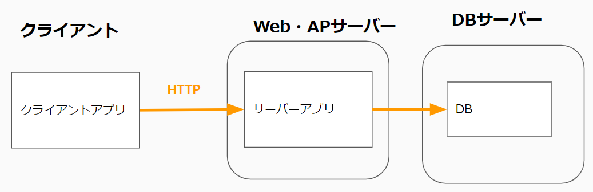
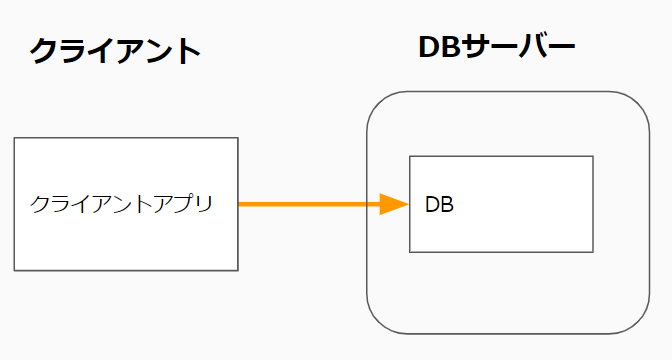
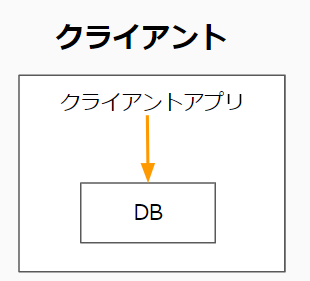

## クライアントアプリとは
クライアント端末上で動作するプログラム。  
クライアント端末にプログラム実行ファイル(exeなど)を配置(インストール)して実行する。  

Windowsの場合、VisualStudio、Excel、Teamsなどはクライアントアプリ。  
iPhoneやAndroidスマホ上で動作するアプリもクライアントアプリ。  

## クライアントアプリの形態

### ①サーバー側プログラムが存在しHTTPで通信を行う形式
クライアントアプリがブラウザの代わりになるイメージ。  
広く配布するアプリは大体この形式。  

#### メリット
- セキュリティ面   
・DBの接続情報をクライアントアプリが持たなくて良い。  
・DBを外部に公開する必要が無い。  

- プログラム変更時の対応が少し楽  
サーバー側プログラムだけの修正で済む場合、クライアントアプリを再インストールしてもらう必要が無い。  

#### デメリット
- コスト面  
・サーバー側も作る分、工数が掛かる。   
HTTP(s)での通信機能をクライアントアプリ側に実装する必要がある。  
(認証情報の持ち方なども考慮する必要がある。)  
・サーバーマシンも用意する必要がある。  

### ②サーバー側プログラムが存在せず、クライアントアプリが直接DBに接続する形式
クライアント端末もDBサーバも社内ネットワークにあり、DBとの通信が社内ネットワーク内しか通らない形式。  
社内ネットワークでのみ使われるアプリでよく選択される。  

#### メリット
- コスト面   
・クライアントアプリのみで済むため実装コストが少ない。  
・サーバーマシンを用意する必要も無い。

#### デメリット
- セキュリティ面  
・クライアントアプリにDBへの接続情報を持つ必要がある。  
・社外にも配布する場合、DBを社外からもアクセスできる位置に配置しなくてはならず、危険。  
社外からアクセスされる場合はWeb・APPサーバーを間にはさんだ①の形式にする必要がある。  

- プログラム変更時の対応  
プログラムを少し変えただけでクライアントの再インストールが必要となる。  

### ③クライアントアプリがDBを内包する形式  
DBを複数クライアントで共有する必要が無い場合、クライアントアプリがDBを内包する形式にする場合がある。  

DBを共有する必要がある場合はこの形式には出来ない。 

この形式の場合によく使われるDBは「SQLite」。  

※SQLiteについて  
必要最小限の機能に絞ったDBで軽量。  
ライブラリとして提供される。  
(C#ならdllで提供される。)  
- 出来ること  
SQL文の実行やトランザクション制御など、基本的なDBの機能。  

- 出来ないこと  
複数クライアントからの同時書き込み不可。    
レプリケーション、スケジュールされたバックアップなど運用面の機能もない。  

### ④DBを持たない形式
簡単なアプリならDBすらないこともある。  
(ストップウォッチアプリとか）  
業務アプリだとほぼ無いかも。  

## Webアプリとクライアントアプリの使い分け

Webアプリとクライアントアプリの主な違いは以下になる。  

|    |  Webアプリ  |  クライアントアプリ  |
| ---- | ---- | ---- |
| 導入のしやすさ | ○ ブラウザさえあればよい。 | × アプリの実行ファイル(exeなど)を配布する必要がある。 またアプリの開発言語に対応する実行環境(.NETFrameworkやJAVA SDK)もクライアントにインストールしてもらう必要がある。|
| 出来ること | △ 大体のことは出来るが、一部実現できない機能がある。 例えば、 ・印刷関係の機能 ・クライアントのローカルファイルにアクセスする機能 ・（スマホアプリの場合）カメラやセンサーなどを制御する機能 | ○ Webで出来ない機能もクライアントアプリなら実現可能な事が多い。 |

Webアプリのほうが手軽な為、優先度は高い。  
Webアプリでも実現できる場合はWebアプリで、出来ないものはクライアプリで実装、とすることが多い。    

