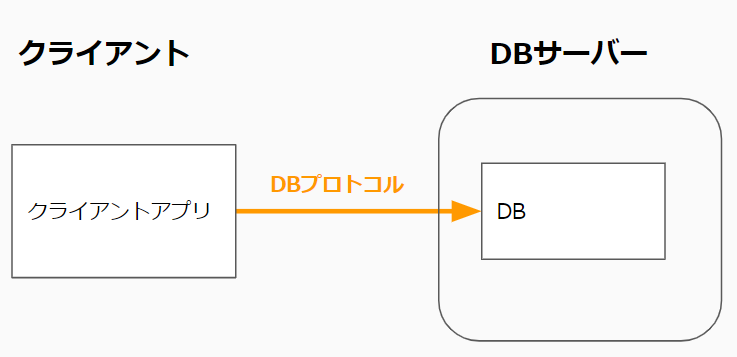

## クライアントアプリとは

クライアント端末上で動作するプログラム。
クライアント端末にプログラム実行ファイル(exeなど)を配置(インストール)して実行する。

Windowsの場合、VisualStudio、Excel、Teamsなどはクライアントアプリ。
iPhoneやAndroidスマホ上で動作するアプリもクライアントアプリ。

## クライアントアプリの形態

### ①サーバー側プログラムが存在しHTTPで通信を行う形式
クライアントアプリがブラウザの代わりになるイメージ。
広く配布するアプリは大体この形式。

#### メリット
- セキュリティが確保しやすい。
DBの接続情報をクライアントアプリが持たなくて良い。

- プログラム変更時の対応が少し楽
サーバー側プログラムだけの修正で済む場合、クライアントアプリを再インストールしてもらう必要が無い。

#### デメリット
- サーバー側も作る分、工数が掛かる。  
HTTP(s)での通信機能をクライアントアプリ側に実装する必要がある。  
(認証情報の持ち方なども考慮する必要がある。)

### ②サーバー側プログラムが存在せず、クライアントアプリが直接DBに接続する形式
社内ネットワークでのみ使われるアプリだとこのケースがある。
(クライアント端末もDBサーバも社内ネットワークにあり、DBとの通信が社内ネットワーク内しか通らない。)

#### メリット
- 実装コスト  
クライアントアプリのみで済むため実装コストが少ない

#### デメリット
- セキュリティ面
社外にも配布する場合、DBを社外からもアクセスできる位置に配置するのは危険な為、この形式は選択できない。  
その場合はWeb・APPサーバーを間にはさんだ①の形式となる。

- プログラム変更時の対応
プログラムを少し変えただけでクライアントの再インストールが必要となる。

### ③クライアントアプリがDBを内包する形式
DBを複数クライアントで共有する必要が無い場合、クライアントアプリだけが使うDBを内包する形式にする場合がある。
その際よく使われるDBは「SQLite」

DBを共有する必要がある場合はこの形式には出来ない。

### ④DBを持たない形式
簡単なアプリならDBすらないこともある。
業務アプリだとほぼ無いかも。

