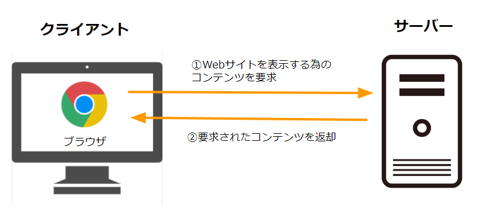
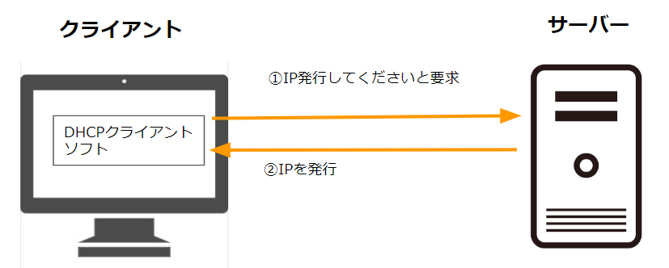
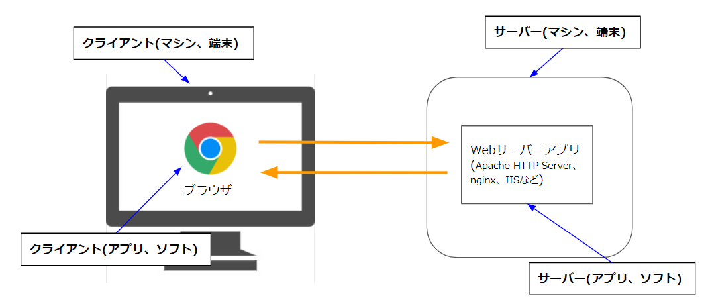
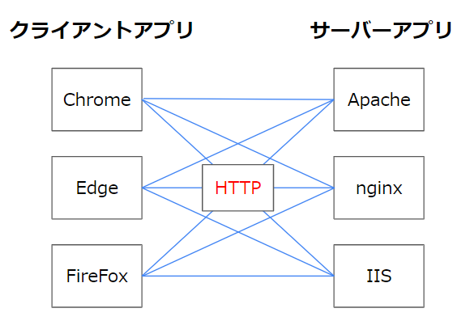

# サーバーとは？  

## なにこれ？  
ITの仕事をしていると、サーバーという単語がよく出てきます。  
ある程度経験がある人は当たり前に使っている単語だと思いますが、文脈によって指しているものが違っていることもある為、新入社員の方などは聞いていて混乱するかも知れません。

この記事はそういった方たちが、サーバーという単語が指す意味合いを理解できるようになることを目的としています。

## 対象者
サーバーと聞いてもよく分からない人

## サーバー（Server）、クライアント（client）の意味
serveという英単語は、「（飲食物などを）出す、（サービスなどを）提供する」という意味合いがあります。
serverとは「提供する人、物」というような意味合いになります。  

また、提供されたサービスなどを利用する人を「client」といいます。  

- server  
(サービスなどを)提供する人や物。

- client  
(サービスなどを)利用する人や物。

  
ITの文脈で出てくるserver・clientも基本的に同じような意味合いになります。

- server  
ある機能やコンテンツについて、それを提供する側（応答する側）のコンピュータまたはソフトウェア  

- client  
ある機能やコンテンツについて、それを利用する側（要求する側）のコンピュータまたはソフトウェア

「あるサービスやコンテンツの提供」というのは、例えばWebサイトの提供などがあります。  

IEやchromeなどのブラウザからgoogleなどのWebサイトを閲覧する場合、大まかに以下の流れでWebサイトが表示されます。  

1. IEやchromeなどのブラウザが、入力されたURLに対応するコンピュータに対して、Webサイトを表示する為のコンテンツを下さいと要求する *1  

1. リクエストを受け取ったコンピュータは、Webサイト表示に必要なファイルなどを返却する *2   

この場合、Webサイトを下さいと要求しているブラウザ側が「クライアント」、クライアントからの要求に応じてWebサイトに必要な情報を返却している側が「サーバー」となります。

*1 DNSという仕組みでURLからIPが分かるので、そのIP向けにHTTPリクエストという形式のメッセージを送信しています。詳しくは別の記事で説明します。  

*2 html、javascript、css、jsonなどを返却します。こちらも詳しくは別の記事で説明します。  

もう1つの例として、DHCPというIPを払い出す機能を利用する場合、
IPを要求する側が「クライアント」、要求を受けてIPを払い出す側が「サーバー」ということになります。

このように、サーバーとクライアントのやりとりはの大まかに以下の流れで行われます。
1. クライアントがサーバーに要求（リクエスト）を投げる
1. サーバーが要求内容に応じた処理を行う（Webサイトのコンテンツの準備、IPの発行など）
1. サーバーがクライアントに処理の結果を返す（レスポンス）

## もう少し細かい言い方
サーバー・クライアントの説明時に、「～するコンピュータまたはソフトウェア」という表現をしました。  
ここを明確に分けて呼ぶ場合もあります。  
決まった言い方は無いので人それぞれな部分はありますが、大体以下のように呼ばれます。

- クライアント側  
ある機能やコンテンツについて、それを利用する側（要求する側）の
  - ソフトウェア  
クライアントアプリ、クライアントソフト　などと呼ばれる

  - コンピュータ  
クライアントマシン、クライアント端末　などと呼ばれる  

Webサイト表示の例でいうと、ブラウザがクライアント（アプリ、ソフト）、ブラウザを立ち上げてるPCがクライアント(マシン、端末)　ということになります。

サーバー側も同じです。
クライアントからの要求への応答は、サーバー側で起動しているアプリケーションが行っています。   

- サーバー側  
ある機能やコンテンツについて、それを提供する側（応答する側）の
  - ソフトウェア  
サーバーアプリ、サーバーソフト　などと呼ばれる

  - コンピュータ  
サーバーマシン、サーバー端末　などと呼ばれる  

Webサイト表示の例だと、サーバーアプリとしてApache HTTP Server、nginx、IISなどがよく使われます（詳しくは別記事で解説します）  
それらのアプリがサーバー（アプリ、ソフト）、それが稼働している端末がサーバー(マシン、端末)ということになります。

アプリやマシン固有の問題で、明確に２つを区別したい場合はこのように細かい言い方になる場合があります。  
利用(要求)する側か、提供（応答）する側かが重要な場合は、いちいち細かい言い方はせずに、まとめて「クライアント」「サーバー」ということが多いです。  
（クライアントサイド、サーバーサイドという事もあります。）

## ○○サーバー
サーバーについて、「ある機能やコンテンツ」を提供するものだと説明しました。  
Webサイトの表示やDHCPを例に出しましたが、他にも様々な機能があります。

- メール送信
- ファイル共有
- データベース
- DNS  
他多数

このうちのどの機能を提供しているサーバーかを判別する為に、機能名や、その機能のプロトコル（HTTP、SMTPなど）を頭につけて呼ぶことも多いです。

例えば以下のように呼ばれます。
- Webサイトを提供しているサーバー  
Webサーバー、Httpサーバー　など

- メール送信機能をしているサーバー  
メールサーバー、SMTPサーバー　など

- ファイル共有機能をしているサーバー  
ファイルサーバー、SMBサーバー　など

システム構成図などでサーバーの一覧を書く際は、このように機能名まで付けて書きます。   
(単に「サーバー」と書かれたものが複数あってもよく分からないので)  

ただ会話の中では、何のサーバーか自明な場合（例えばWebサイト表示の話をしている場合）、省略して単にサーバーといわれる事も多いです。　　

### プロトコル  
ここではアプリケーション層のプロトコルの事を指します。  
ある機能において、クライアントとサーバーがやり取りする際の仕様・ルールのことです。  
例えばWebサイト表示の場合、クライアント側のアプリ（ブラウザ）と、サーバー側のアプリは、「HTTP」という仕様に乗っ取ってデータをやり取りしています。  
（例えば送信元IPはここに書く、このデータとこのデータの間は1行空ける、などのルールが定義されています）

ブラウザにはchrome、firefox、IEなど様々な種類がありますし、サーバー側のアプリもapache、nginx、IISなど様々なアプリがあります。  
上記のどんな組み合わせでもWebサイトを表示する事が可能です。  
それはクライアント側、サーバー側両方のアプリが、「HTTP」という共通のルールに従ってやりとりするよう実装されている為です。  
(正確にはHTTPだけではなく、htmlやjavascriptなども仕様が決められています)  

（新しい仕様が策定された場合など、その仕様への対応が遅れているブラウザで上手く表示できないサイトがある、みたいになることもありますが。。）

## 「機能の提供」について
サーバーにおいて、「○○の機能を提供している」とは具体的にどのような状態でしょうか。  
それは、「○○の機能をもったアプリケーションが稼働している状態」を指します。

例えばWebサーバーとは、「Webサーバーアプリがインストールされており、稼働している（他の端末からの要求を受け付けられる）状態のコンピュータ」ということになります。  

図

なので、あるコンピュータをWebサーバーとして利用する場合、大まかに以下の手順を踏むことになります。  
1. コンピュータにWebサーバーアプリをインストール※
1. インストールしたWebサーバーアプリを起動  
1. Webサーバーアプリが外部からの通信を受け付けられるように設定  

そのように設定できるコンピュータであれば何でもWebサーバーに出来ます。
例えば、皆さんが使っているノートPCに上記の設定をすればそれはWebサーバーと言えます。

※サーバーのOSに初めから含まれている場合もあります。  
例えばWindosServerというOSにはIISというWebサーバーアプリが最初から含まれています。

また、1台のコンピュータで複数のアプリケーションを稼働させることも可能です。  
ある端末でWebサーバーアプリとDHCPサーバーアプリが稼働している場合、それはWebサーバー兼DHCPサーバーと言えます。  
（このように1台に機能をまとめると負荷が高くなったり、障害に弱くなったりする為、重要な機能は別々の端末にすることが多いです。）

図  

### サーバーアプリとポート
上記のように複数の機能が提供されているサーバーにおいて、どの機能に対する要求かをどのように判別しているのでしょうか。
それは、サーバーアプリが紐ついているポートによって判断されます。

図

サーバーアプリを立ち上げると、そのプロセスがOSの特定のポートを監視(LISTEN)し始めます。
あるポートへのリクエストが来ると、そのポートを監視しているアプリにリクエストが受け渡されます。

サーバーアプリは、監視(LISTEN)したいポート番号をオペレーティングシステム（OS）に登録し、そのポートに接続要求があると通知を受けて処理を行います。

１つのプロセスで複数のポートをLISTENすることも可能です。
だた１つのポートに紐つくプロセスは１つと決まっています。
なので、どのアプリへの通信か分からないということにはなりません。
（主要なOSは全て同じ動作です。）

図

ある機能においてクライアントとサーバーで通信する際の仕様を「プロトコル」というと説明しました。  
主要なプロトコルについて、使うべきポートがあらかじめ決められています。  
例えばHTTPポートは80、HTTPSは443などです。  
大半のサーバーアプリは、使用するプロトコルで決められたポートを使うようにデフォルトで設定されています。  
WebサーバーアプリであればHTTP、HTTPSの80、443をLISTENします。  
セキュリティ対策としてあえてポートを変えるようなこともありますが、一般に公開されているWebサイトなどはデフォルトのポートを使うことが多いかと思います。  
（変えるとクライアント側も対応しなくてはないので。例えばhttpを81ポートで公開した場合、URLに:81と付けなくてはいけない。）

ちなみに、クライアント側のポートは何でもいいので、空いているポートをランダムで使用することアプリが多いです。

図

## サーバー用の機器（ハード面でのサーバー）
前述の通り、サーバーとはある機能を提供しているコンピュータのことであり、その機能さえ提供できればノートPCなどをサーバーとして利用する事も可能です。  

例えば少人数の会社で社員しか利用しない場合や、個人で利用する場合は余っているPCをサーバーとして使う、みたいなこともあるかと思います。  

ただ利用人数が増えてきたり、インターネットに公開しているサーバー（企業サイトを公開しているWebサーバーなど）の場合、アクセス数も多くなりサーバーに対する負荷も高くなります。  
その場合、個人利用が目的のPCではスペック的に不足してしまいます。  

その為、負荷が高いサーバー用途に使える、ハード的に高スペックなサーバー用機器が販売されています。  

例  

これらのサーバー用機器は以下のような特徴があります。  

- 高いスペック
- 拡張が容易
- 複雑な構成をとりやすい

サーバー機器を置き換えたい、という文脈の話をしている際は、サーバー機器の事を指してサーバーと言うこともあります。  

### クラウドやレンタルサーバー
サーバー用の機器を購入した場合、機器を置くスペースを確保したり、機器を自分たちでメンテナンスしていく必要があります。  
機器を配置するスペースの温度管理などしなければいけないですし、地震などで倒れないように設置する必要があります。  
また機器をメンテナンスするにはスキルを持った人員を確保する必要があります。  

それらの負担を回避するために、レンタルサーバーやクラウドのIaasと呼ばれるサービスを利用する事も多いです。  

利用イメージは以下になります。  

1. 利用者が必要なサーバーのスペックやOSの種類など指定
（サービス提供業者が用意したWebサイトから指定出来ることが大半です。）

1. サービス提供業者が指定されたスペックのサーバーを用意

1. 利用者はリモート接続*でサーバーを管理

*OSがWindowsならリモートデスクトップ、LinuxならSSHで接続します。

### 仮想サーバー
1台の端末で複数のOSを稼働させることが出来ます。

## Windowsのサーバーエディション  

Windowsには、Windows10などの個人利用用のエディションと、WindowsServerというサーバー用のOSがあります。  

WindowsServerにはサーバー用途に適した機能が豊富です。  
例えば以下のような機能です。  

比較表

Windows10などのOSでもサーバーとして利用することは可能です。  
（例えばWindows10でIISを有効にすればWebサーバーとして使えます。）

ただ業務用途ではセキュリティなどの信頼性が求められることが多い為、基本的にはWindowsServerの方を使います。  
(サーバーOSをWindowsにする場合はの話です。  
そもそもサーバー用のOSとしてはWindowsではなくLinux系が使われることも多いです。)

  

これらのアプリは、リクエストを受取りWebページを返すという基本的な動作は同じですが、
設定方法が違ったり得意な部分が異なります。  
(例えばapacheは～)  
それらを加味してどのアプリを使うか判断することになります。  

さらにそのサーバーA上のブラウザでgoogleなどのサイトを見る場合どうなるでしょうか。  

この場合、クライアントAのgoogle.comを開くという作業については、サーバーAはWebサーバーになります。

例えば今使ってるノートPCにWebサーバのソフトをインストールし、インターネットから接続できるように設定しすればWebサーバーになります。  　
実際に余ったデスクトップをファイルサーバーとして使ってたりもした。　　
ただ、サーバー側はみんなからアクセスされるので必要なスペックが高い。　　

  

ここは図を書く。  
・1台の端末で複数の機能を提供する事も出来る。
　
　Webサーバ　と　メールサーバー
　端末A →サーバにブラウザで接続
　端末B →　サーバにメールを送信

　端末AにとってはサーバAはWebサーバ
　端末BにとってはサーバBはメールサーバ
　サーバAでブラウザを立ち上げてサーバBのWebサイトをみれば
　サーバBにとってはサーバAはクライアント
　→1台の端末がいろいろな役割をもつ
　→結局はある機能を提供している側がサーバーと呼ばれる
　

・サーバーアプリの動作イメージ
　　・プロセスがポートを見てる
　　・ポートに来たリクエストをアプリが感知
　　・感知した後の動作はアプリによる
　　・Webサーバーの場合
　　　　・URLに対応したファイルを返却
　　・アプリサーバーの場合
　　　　・URLに対応したプログラムを呼び出し→結果を返却